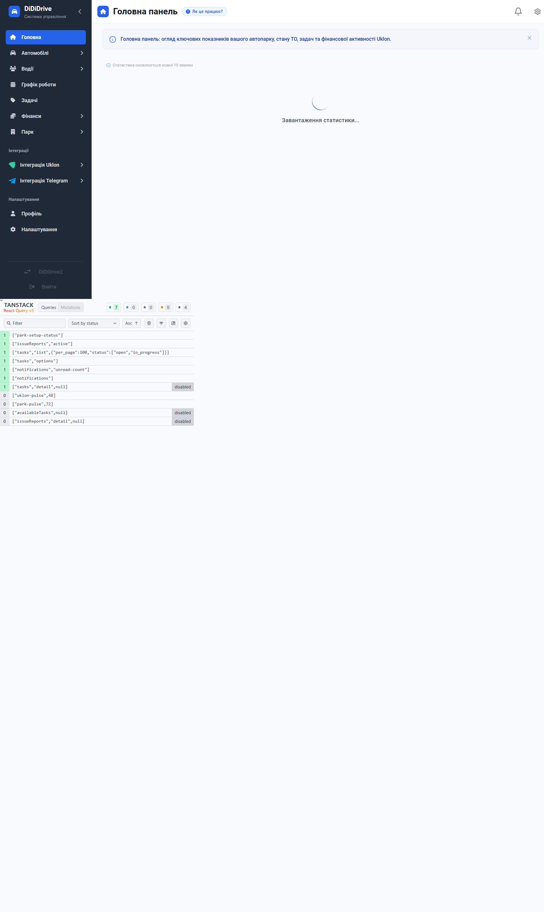

# Головна панель

**Керуйте автопарком з єдиної інформаційної панелі — миттєвий огляд стану парку, критичних завдань та фінансової активності.**

Головна панель Garage24 — це командний центр вашого автопарку. З першого погляду бачите стан всіх машин, критичні проблеми з обслуговуванням, терміни дійсності документів та активні завдання вашої команди. Система оновлює дані кожні 10 секунд, тому ви завжди маєте актуальну інформацію без ручного перезавантаження.

## Що ви контролюєте на дашборду

**Статистика вашого парку в цифрах**

Одразу бачите, скільки машин активні, скільки припинено, та загальний рівень завантаженості. Ці цифри оновлюються автоматично та показують реальний стан вашого автопарку в даний момент.

**Активність в Уклон**

Якщо ви працюєте через платформу Уклон, панель показує статус інтеграції та останні дані про активність. Ви відразу бачите, чи все працює правильно з платформою, та можете відстежити обсяги замовлень.

**Стан всіх автомобілів з розбивкою по часу**

Список всіх машин з поточним статусом — знаходяться у найманні, припинені або не використовуються. Система групує машини та показує час останньої дії для кожної, щоб було зрозуміло, скільки часу машина в тому чи іншому стані.

**Критичне обслуговування — машини, що потребують негайного ТО**

Таблиця видима на дашборді показує всі автомобілі, у яких пропущені або перевищені регламенти технічного обслуговування. Це не дає вам забути про важливі роботи, які впливають на безпеку та довговічність парку.

**Проблеми з документами — термін дії спливає**

Система відстежує всі документи вашого парку та автоматично попереджує про закінчення терміну дії — свідоцтва, страховки, технічні огляди та інші дозволи. Ви завжди знаєте, що потрібно поновити та хто з автомобілів готовий до інспекції.

**Ваші активні завдання та пріоритети**

Панель показує всі ваші поточні завдання зі статусами "Відкрито" і "В роботі". Потрібна нова задача? Натисніть кнопку додання і миттєво сформуйте її прямо з дашборду. Можна змінювати статус, позначати завершено або видаляти — все керується прямо з таблиці.

**Відкриті звіти про проблеми**

Список всіх технічних інцидентів та проблем, які виникли в парку та потребують вашої уваги.

## Персоналізуйте дашборд під вашу команду

Кожен член вашої команди може налаштувати дашборд під себе. Через модальне вікно налаштувань вибираєте, які віджети важливі саме для вас — відключаєте ненужні, залишаєте тільки те, що потрібно. Налаштування зберігаються для кожного користувача окремо, тому діспетчер бачить одне, а менеджер — інше.

## Для нових парків — інтерактивний прогрес налаштування

Якщо ви щойно почали роботу з системою, дашборд показує вам інтерактивні картки онбординга з прогресом налаштування:

- додайте перших автомобілів до парку
- зареєструйте водіїв
- налаштуйте регламенти обслуговування
- підключіть інтеграцію з Уклон (якщо потрібна)
- налаштуйте сповіщення в Telegram
- налаштуйте сторінку вашого парку на Landing

Картки показують прогрес налаштування та дають можливість приховати їх, коли налаштування завершено.

---

**Основний сценарій роботи:** диспетчер або менеджер парку входить на дашборд на початку зміни, щоб оцінити стан парку за 30 секунд — скільки машин активно, які критичні проблеми чекають, які завдання потрібно виконати. На основі цієї інформації планується робота дня. Кожні 10 секунд дані оновлюються автоматично, тому ви завжди маєте актуальну картину без необхідності вручну перевіряти статус кожної машини чи задачі.
