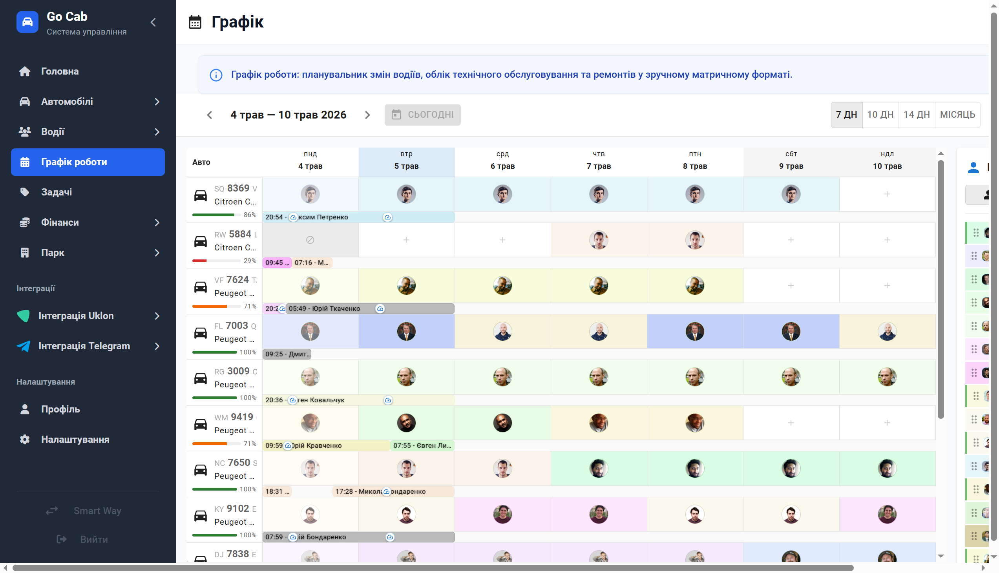

# Графік роботи

**Плануйте роботу автопарку без зусиль за допомогою інтерактивного матричного планувальника.**

Графік роботи: планувальник змін водіїв, облік технічного обслуговування та ремонтів у зручному матричному форматі. Це потужний інструмент, який дозволяє диспетчеру бачити повну картину зайнятості водіїв та автомобілів, запобігаючи простоям та конфліктам у розкладі.

## Інтелектуальне планування та гнучкість

- **Повний цикл керування змінами.** Створюйте нові слоти, редагуйте деталі або видаляйте неактуальні записи миттєво. Весь процес керування розкладом (CRUD) тепер зібраний в одному зручному інтерфейсі.
- **Швидке переміщення Drag & drop.** Просто перетягуйте слоти по графіку для оперативного коригування. Система миттєво перераховує навантаження та оновлює стан парку.
- **Миттєве копіювання з Ctrl.** Заощаджуйте час на рутинному заповненні: утримуйте клавішу **Ctrl** під час перетягування, щоб скопіювати зміну на інший день або іншого водія.
- **Точне розміщення та SWAP.** Використовуйте функцію вставки перед або після цільового слота для ідеального порядку. Потрібно швидко поміняти водіїв місцями? Використовуйте жест **центрального розміщення (SWAP)** для миттєвого обміну змінами.
- **Масштабне планування з перевіркою.** Клонуйте слоти на кілька днів вперед. Система автоматично перевіряє доступність водія та автомобіля перед створенням, гарантуючи відсутність помилок та "подвійних призначень".
- **Деталізація робочого дня.** Потрібно додати другу зміну або короткий виїзд? Функція **розщеплення слотів** дозволяє гнучко додавати нові періоди роботи в межах одного дня.
- **Глибока аналітика в Excel.** Одним кліком генеруйте XLSX-звіт, який містить три детальні аркуші: повний графік, підсумок роботи по кожному водієві та аналіз завантаженості всього автопарку.

## Контроль та адаптивність

- **Індивідуальний масштаб огляду.** Налаштовуйте кількість днів для відображення — 7, 10 або цілий місяць. Система запам'ятає ваш вибір у **localStorage**, щоб при наступному вході ви бачили зручний для вас масштаб.
- **Інтуїтивна навігація.** Легко переміщуйтеся між періодами (попередній/наступний) або миттєво повертайтеся до **поточної дати**, щоб завжди бачити актуальний стан справ.
- **Прозорість: план vs факт.** Система відображає не лише планові слоти, а й фактичні зміни. Переглядайте деталі водія та реальний стан виконання графіку в одному вікні.
- **Захист від помилок у минулому.** Контролюйте безпеку даних за допомогою прапорця **allowPastEditing**. Ви можете заблокувати редагування минулих слотів, щоб історія роботи залишалася незмінною та достовірною.
- **Автоматичний підрахунок призначень.** Система самостійно рахує кількість виїздів для кожного водія за обраний період, надаючи готові дані для фінансового обліку.
- **Повноцінна робота зі смартфона.** Спеціальна мобільна версія має адаптивну навігацію та виносить усі **дійсні дії прямо в заголовок**, дозволяючи керувати графіком "на ходу" так само ефективно, як і з десктопа.

## Додатковий контекст та поради

- **Безпечне клонування:** Система — ваш запобіжник. Під час клонування вона автоматично перевіряє, чи вільний автомобіль та водій у вибраний час, запобігаючи операційним помилкам.
- **Управлінський облік:** Використовуйте автоматичний розрахунок завантаженості авто в Excel-експорті для оптимізації кількості машин у вашому парку.
- **Мобільна безпека:** На мобільних пристроях система автоматично блокує редагування минулих періодів, щоб ви могли безпечно переглядати графік під час зустрічей чи поїздок.
