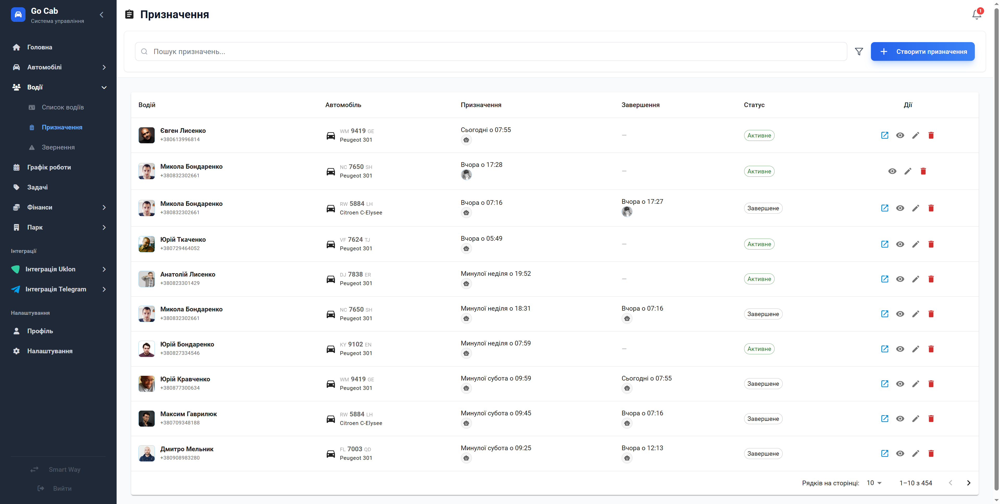

# Керування призначеннями водіїв

Керуйте розкладом та закріпленням водіїв за автомобілями вашого автопарку в режимі реального часу.

Цей модуль забезпечує повний контроль над історією призначень, дозволяючи диспетчерам миттєво відстежувати, хто з водіїв керує конкретним автомобілем у даний момент. Система автоматизує фіксацію пробігу та актів прийому-передачі, мінімізуючи помилки та підвищуючи прозорість роботи автопарку.

## Основні можливості

Керування призначеннями стає простішим завдяки інструментам, які вирішують типові завдання диспетчера:

- **Контроль історії та поточних призначень:** Миттєвий доступ до того, хто зараз за кермом та хто керував авто раніше.
- **Гнучка фільтрація:** Швидкий пошук за водієм, автомобілем, статусом (активне/завершене) або конкретним періодом часу для швидкого звітування.
- **Швидкий пошук:** Знаходьте потрібні записи за іменем водія або держномером автомобіля за лічені секунди.
- **Фіксація пробігу:** Створюйте призначення з фіксацією початкового пробігу та завершуйте їх із зазначенням фінальних даних, що важливо для контролю ТО.
- **Візуалізація активності:** Чітка індикація активних призначень у списку для швидкої навігації.
- **Telegram-інтеграція:** Отримуйте доступ до фото- та відеозвітів прийому-здачі авто безпосередньо через посилання на Telegram-чат.
- **Зручне відображення:** Пагінація та сортування за датою дозволяють комфортно працювати навіть з великими архівами призначень.

## Поради та рекомендації

- Використовуйте фільтри для постійного моніторингу активних змін, щоб своєчасно реагувати на завершення призначень.
- Завжди перевіряйте початковий пробіг при створенні нового призначення — це запорука точності наступних сервісних прогнозів.

## Форми та дії

### Фільтри призначень

Використовуйте цей інструмент для швидкого налаштування списку призначень за ключовими параметрами (водій, авто, період, статус).

### Створення та редагування призначення

Форма дозволяє швидко закріпити водія за авто, вказавши початковий пробіг та дату початку роботи.

### Детальна інформація про призначення

Переглядайте повну історію періоду використання авто, включно з даними користувачів, примітками та посиланнями на медіа-звіти в Telegram.
