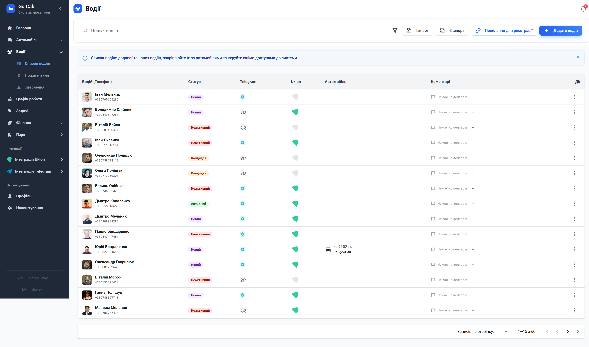

# Керування водіями

Ефективно керуйте персоналом автопарку: від реєстрації та навчання до контролю роботи в режимі реального часу.

Модуль «Водії» — це центральний хаб для роботи з вашою командою. Він дозволяє не просто зберігати контактні дані, а тримати руку на пульсі: бачити, хто з водіїв зараз активний, кому призначено автомобіль, і які нотатки залишали колеги щодо їхньої роботи. Система автоматизує рутину, від масового імпорту до підключення водіїв через Telegram, звільняючи час для стратегічних рішень.

## Основні можливості

Ми розробили інструменти, які допомагають уникнути хаосу в управлінні великим парком:

- **Повний життєвий цикл водія:** Легке створення, редагування та архівація профілів. Функція копіювання дозволяє за секунди створити профіль нового водія на основі існуючого.
- **Розумна фільтрація та пошук:** Знаходьте потрібних працівників за статусом, наявністю авто чи іншими критеріями завдяки гнучким фільтрам.
- **Інтеграція з Telegram:** Кожен водій може бути підключений до вашого Telegram-бота, що забезпечує оперативний зв'язок та автоматичне оновлення статусів.
- **Внутрішній журнал нотаток:** Ведіть історію коментарів по кожному водію — це корисно для передачі справ між менеджерами.
- **Автоматизація даних:** Пакетний імпорт з Excel позбавляє від ручного введення десятків карток, а експорт допоможе швидко сформувати звітність.
- **Контроль призначень:** Зручне управління закріпленням автомобілів прямо з картки водія.

## Важливі поради

- **Використовуйте теги та коментарі:** Це найкращий спосіб утримати контекст роботи водія, особливо в парках, де працюють декілька диспетчерів.
- **Підключайте Telegram завчасно:** Це значно спрощує інформування водіїв та збір даних про пробіг без зайвих дзвінків.

## Форми та дії

### Фільтри водіїв

Миттєво відбирайте водіїв за активністю, Telegram-статусом або типом призначеного авто для швидкого аналізу ситуації.

### Створення та редагування водія

Заповнюйте всю необхідну інформацію: від персональних даних та контактів родичів до фотографії — все в одному зручному вікні.

### Деталі водія

Повний доступ до досьє працівника: стаж, історія поїздок, контакти та поточний статус.

### Призначення авто

Швидко закріплюйте доступний транспортний засіб, фіксуючи дату передачі для точного обліку.

### Підключення до Telegram

Згенеруйте персональне посилання або QR-код, щоб водій зміг автоматично приєднатися до системи сповіщень.

### Журнал коментарів

Внутрішня стрічка нотаток для фіксації важливих моментів: від успішних змін до зауважень щодо дотримання правил.
