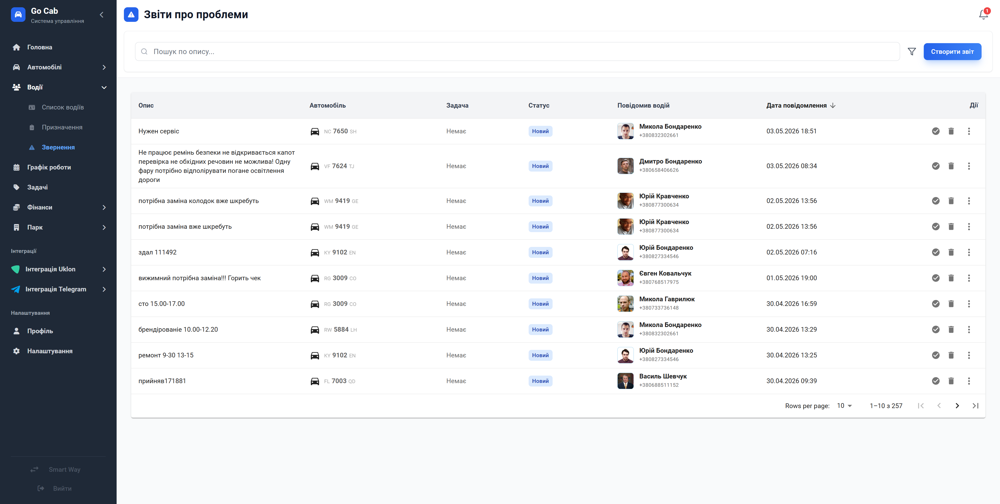

# Журнал звернень та інцидентів

Контролюйте технічний стан автопарку: оперативно фіксуйте, аналізуйте та вирішуйте будь-які проблеми, що виникають під час роботи.

Модуль «Звернення» — це ваш інструмент для перетворення хаотичних повідомлень від водіїв на структуровані задачі. Замість того, щоб губити скарги в месенджерах, ви отримуєте повний контроль над життєвим циклом кожної проблеми: від першого повідомлення до остаточного закриття звітів. Це дозволяє вчасно виявляти критичні поломки, планувати ремонт та тримати автопарк у справному стані.

## Основні можливості

Система допомагає структурувати процес обробки інцидентів:

- **Централізований облік:** Всі технічні та оперативні проблеми з автомобілями в одному зручному журналі.
- **Повний контроль статусу:** Кожне звернення має свій статус — ви завжди знаєте, які питання потребують негайної реакції, а які — в процесі виконання.
- **Інтеграція з задачами:** Створюйте ремонтні задачі безпосередньо з інцидентів або прив'язуйте звернення до вже існуючих завдань.
- **Швидка фільтрація та пошук:** Миттєво знаходьте потрібні звіти за пріоритетом, автомобілем, водієм чи статусом вирішення.
- **Прозорість історії:** Переглядайте повну хронологію дій адміністраторів по кожному інциденту, що важливо для аудиту та контролю якості.
- **Гнучке прийняття рішень:** Відхиляйте неактуальні повідомлення, запитуйте додаткову інформацію або миттєво закривайте звернення з коментарем.

## Поради та рекомендації

- **Своєчасна реакція:** Регулярно переглядайте нові звернення з пріоритетним статусом, щоб не допустити простою автомобілів через невчасно виявлені несправності.
- **Використовуйте задачу:** Для складних інцидентів завжди створюйте або прив'язуйте задачу — це дозволяє механікам і диспетчерам працювати синхронно.

## Форми та дії

### Фільтри звітів

Використовуйте фільтри для швидкого фокусування на конкретному напрямку: наприклад, відберіть усі аварійні звернення за останні 3 дні.

### Створення звіту

Швидко реєструйте проблему: опишіть суть, виберіть тип інциденту та прикріпіть фото — це значно спрощує подальшу діагностику.

### Керування інцидентом

Вирішуйте долю звернення: призначайте виконавців, змінюйте статуси, додавайте коментарі або перетворюйте проблему на повноцінну задачу.

### Деталі інциденту

Повний огляд історії інциденту, включаючи обговорення, прикріплені матеріали та пов'язані адміністративні дії.

### Інформація про задачу

Стежте за прогресом виконання задачі, що була створена для усунення технічної несправності, безпосередньо зі звіту.
