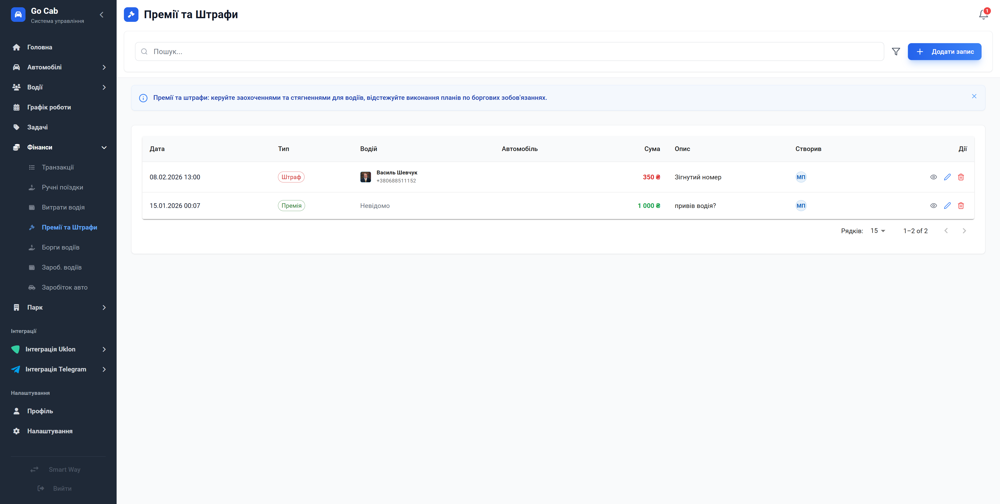

# Премії та Штрафи

Керуйте фінансовою дисципліною водіїв: оперативно заохочуйте за успіхи та застосовуйте стягнення за порушення в одному зручному інтерфейсі.

Модуль «Премії та Штрафи» створений для прозорого фінансового обліку взаємовідносин з водіями. Він дозволяє автоматизувати процес нарахування бонусів, виписування штрафів та управління борговими зобов’язаннями. Це виключає непорозуміння, забезпечує справедливу систему оцінки праці та дозволяє менеджменту тримати фінансову дисципліну під повним контролем.

## Основні можливості

Система допомагає структурувати фінансові операції з персоналом:

- **Повний фінансовий журнал:** Облік усіх видів нарахувань та стягнень — від премій за гарні результати до штрафів за порушення або списання боргів.
- **Гнучке управління записами:** Легке створення, редагування та видалення записів про фінансові операції з водіями.
- **Швидкий аналіз:** Використовуйте фільтри та пошук, щоб за секунди отримати звіт по конкретному водію, періоду або типу фінансової операції.
- **Прозорість даних:** Кожен запис чітко класифікований, що дозволяє швидко формувати аналітику для розрахунку заробітної плати.
- **Пагінація списку:** Комфортна робота навіть з великими архівами даних за тривалі періоди часу.

## Поради та рекомендації

- **Регулярність:** Вносьте дані про премії та штрафи своєчасно, щоб водій мав актуальну інформацію про свій поточний баланс та стан боргів.
- **Коментарі:** Додавайте детальний опис до кожного запису, щоб у майбутньому не виникало запитань щодо причин нарахування чи стягнення.

## Форми та дії

### Фільтри

Використовуйте інструмент фільтрації для швидкого пошуку потрібних записів за типом операції, водієм чи датою.

### Додати/Редагувати запис

Зручна форма для швидкого створення або коригування фінансового запису — вкажіть суму, оберіть водія та категорію операції.

### Деталі запису

Переглядайте повну інформацію про обрану премію чи штраф, включно з історією створення та описом.
