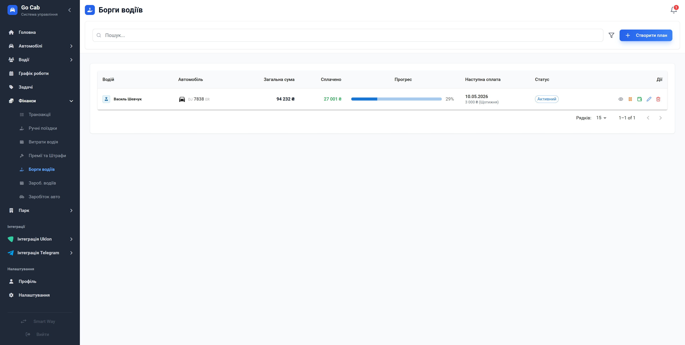

# Управління боргами водіїв: стабільність вашого автопарку

Перетворіть заборгованість на структурований процес повернення коштів без конфліктів та довгих розрахунків.

Керування боргами — це завжди тонкий момент у відносинах з водіями. Модуль «Плани боргів» створений, щоб прибрати емоційну складову з цього процесу. Замість того, щоб щоразу згадувати про заборгованість, ви створюєте чіткий план погашення, який система автоматично контролює. Ви отримуєте повну прозорість фінансових потоків, а водій — зрозумілий графік виплат, що сприяє довірі та довготривалій співпраці.

## Що це дає вашому бізнесу?

- **Прогнозованість надходжень:** Кожен план має свій графік. Ви чітко бачите, скільки коштів буде повернено і коли.
- **Зменшення дебіторської заборгованості:** Автоматизація дозволяє не втрачати з поля зору жоден борг, навіть найменший.
- **Цивілізований діалог:** Коли ви спілкуєтеся з водієм, ви спираєтеся не на пам'ять, а на офіційний документ у системі. Це професійний підхід, що мінімізує суперечки.
- **Контроль стану в один клік:** Ви бачите прогрес кожного плану, відсоток погашення та залишок боргу в реальному часі.
- **Гнучкість:** Життя буває різним. Ви можете призупинити план, якщо водій потрапив у складну ситуацію, або відновити його, коли він повернеться до роботи.

## Як це працює?

Ми спростили складні фінансові операції до рівня інтуїтивно зрозумілих дій:

1.  **Створіть план:** Вкажіть суму боргу, графік та умови погашення.
2.  **Контролюйте виконання:** Система веде облік усіх платежів.
3.  **Виправляйте та коригуйте:** Якщо водій вирішив закрити борг достроково або приніс готівку — просто додайте платіж вручну.
4.  **Слідкуйте за статусом:** Якщо план стає неактивним, система сигналізує про це.

## Функціональна довідка

### Фільтри плану

Швидка навігація серед десятків боргів. Відфільтруйте тих, хто активно погашає заборгованість, від тих, хто потребує вашої уваги зараз.

### Робота з планом

Створюйте нові зобов'язання або редагуйте існуючі умови. Всі зміни відображаються миттєво.

### Ручне списання платежів

Отримали платіж поза графіком? Зафіксуйте його в один клік — система автоматично оновить залишок заборгованості.

### Детальна аналітика

Глибоке занурення в історію кожного боргу: початкова сума, історія оплат та фінальний статус.
