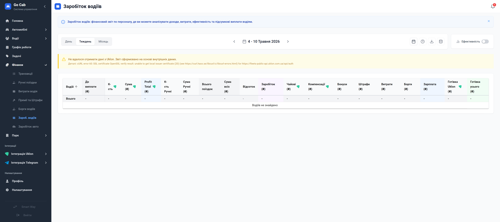

# Аналітика заробітку: контроль кожного доходу

Отримуйте повну картину прибутковості вашого персоналу — від окремої поїздки до фінальної суми виплат.

Модуль «Заробіток водіїв» — це ваш фінансовий навігатор. Він перетворює сирі дані про поїздки на чітку аналітику, що дозволяє миттєво оцінити ефективність роботи кожного водія та загальну результативність автопарку. Забудьте про ручні розрахунки в таблицях: система автоматично враховує бонуси, витрати та операційні показники, надаючи вам готові цифри для прийняття зважених управлінських рішень.

## Чому це важливо?

- **Максимальна прозорість:** Ви бачите, з чого складається дохід кожного водія, що зводить до мінімуму запитання та сумніви з боку персоналу.
- **Глибока аналітика:** Розумійте не тільки "скільки заробили", а й "чому так". Аналізуйте витрати та ефективність у розширеному режимі.
- **Швидкий експорт:** Один клік — і готовий фінансовий звіт у форматі Excel уже на вашому комп’ютері.
- **Інтеграція з Uklon:** Актуальний статус інтеграції завжди перед очима — ви завжди впевнені, що дані, які ви бачите, є точними та вчасними.
- **Ефективне керування:** Обирайте часові періоди для звітності, фільтруйте водіїв за активністю та миттєво знаходьте найбільш продуктивних працівників.

## Як працювати зі звітом?

1.  **Налаштуйте діапазон:** Оберіть період (день, тиждень, місяць), який вас цікавить.
2.  **Аналізуйте показники:** Використовуйте таблицю для порівняння доходів, бонусів та витрат.
3.  **Заглиблюйтесь у деталі:** Потрібно дізнатися більше про конкретного водія? Клікніть на картку, щоб відкрити повну фінансову історію.
4.  **Звітуйте:** Експортуйте дані для бухгалтерської звітності або аналізу ефективності.

## Функціональна довідка

### Розуміння розрахунків

Не залишайте місця для здогадок — вивчайте логіку нарахувань безпосередньо в інтерфейсі.

### Деталі заробітку водія

Повний розріз фінансових показників водія, що дозволяє побачити ефективність роботи в розрізі бонусів та витрат.

### Робота з даними

Для детального аналізу або технічної перевірки завжди є доступ до "сирих" даних, на основі яких формуються звіти.
