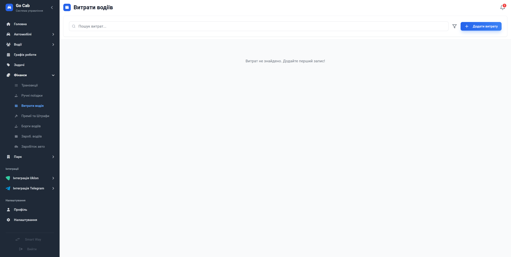

# Облік витрат водіїв: фіксуйте кожну гривню

Тримайте під контролем дрібні операційні витрати, щоб мати повне уявлення про прибутковість кожного автомобіля та роботу водіїв.

Часто саме дрібні витрати — на миття, дрібний ремонт чи інші операційні потреби — стають причиною дірок у фінансовому звіті. Модуль «Витрати водіїв» створений для того, щоб ви могли легко фіксувати такі платежі, прив'язувати їх до конкретних авто та завжди мати під рукою підтверджуючі документи. Більше ніяких загублених чеків чи забутих витрат — все структуровано, прозоро та доступно для аналізу.

## Чому це важливо для автопарку?

- **Повний контроль фінансів:** Бачите реальну собівартість експлуатації кожного авто, враховуючи навіть найменші витрати.
- **Дисципліна водіїв:** Завдяки системі обліку водії відповідальніше ставляться до звітування за надані кошти.
- **Підтвердження документами:** Прикріплюйте фото чеків чи актів безпосередньо до запису витрати — у вас завжди є докази здійсненої операції.
- **Зручне категоріювання:** Розумійте, куди йдуть кошти: пальне, миття, паркування чи технічне обслуговування.
- **Звільнення часу:** Створення та обробка запису займає кілька секунд, що дозволяє диспетчерам не відволікатися від основних задач.

## Як це спрощує роботу?

- **Оперативність:** Щойно водій здійснив витрату, ви можете зафіксувати її в системі.
- **Аналітична звітність:** Вся історія витрат доступна для аналізу в будь-який момент часу. Ви можете легко відфільтрувати витрати за категорією, водієм або автомобілем.
- **Надійність:** Видалення або редагування записів завжди фіксується, що забезпечує високий рівень контролю.

## Функціональна довідка

### Фільтри витрат

Швидко знаходьте потрібні записи, відсортувавши їх за потрібною категорією або діапазоном дат.

### Робота з витратами

Створюйте або коригуйте дані про витрати водія — все просто та зрозуміло.

### Деталі витрати

Переглядайте повну інформацію, включаючи прикріплені файли та історію внесення даних.
