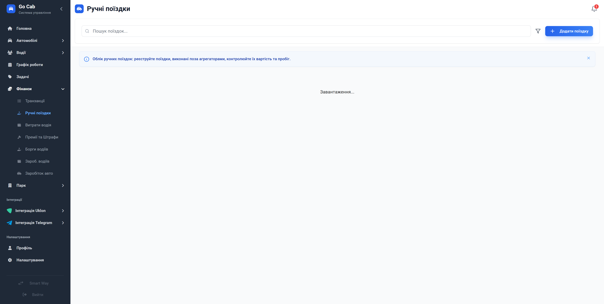

# Ручні поїздки: повний облік прибутковості

Фіксуйте кожну поїздку, виконану поза агрегаторами, щоб мати реальне уявлення про валовий дохід вашого автопарку.

Робота автопарку — це не тільки замовлення через Uklon чи інші сервіси. Часто водії виконують приватні замовлення або поїздки "з руки". Якщо ці кошти не враховані, ви бачите лише частину прибутку. Модуль «Ручні поїздки» створений для того, щоб ви могли легко реєструвати такі замовлення, контролювати вартість та пробіг, забезпечуючи 100% фінансову прозорість бізнесу.

## Чому варто використовувати облік ручних поїздок?

- **Абсолютна фінансова картина:** Бачите реальні надходження від усіх поїздок, а не лише від агрегаторів.
- **Дисципліна водіїв:** Коли водій знає, що кожна виконана поїздка має бути зафіксована, він відповідальніше ставиться до звітів.
- **Оперативний аналіз:** Оцінюйте ефективність окремих водіїв та автомобілів, враховуючи всі джерела їхнього доходу.
- **Зручне керування:** Реєстрація поїздки займає лічені секунди, а система автоматично додає її до загального фінансового звіту.
- **Прозорість для менеджменту:** Ви завжди знаєте, чим займається автопарк, і можете вчасно реагувати на невідповідності у звітах.

## Можливості для ефективної роботи

- **Швидка реєстрація:** Створюйте записи про поїздки в пару кліків після виконання.
- **Аналітичні фільтри:** Знаходьте поїздки за конкретним водієм, авто або датою для швидкої перевірки.
- **Деталізація:** Додавайте всі важливі дані — від пробігу до вартості — для точного обліку.
- **Безпека даних:** Вся інформація надійно зберігається та доступна для подальшого аудиту.

## Функціональна довідка

### Фільтрація поїздок

Використовуйте фільтри для швидкого пошуку конкретних замовлень серед усіх ручних поїздок за обраний період.

### Створення поїздки

Інтуїтивна форма для фіксації основних параметрів: вкажіть водія, авто та фінансовий результат поїздки.

### Деталі поїздки

Повний перегляд історії: дата, час, маршрутні дані та фінансовий підсумок — все в одному вікні.
