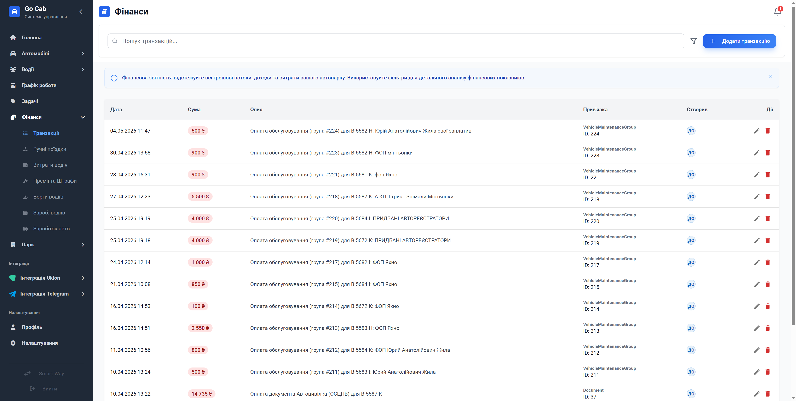

# Фінансовий пульс автопарку: всеосяжний облік транзакцій

Перетворіть потік хаотичних платежів на струнку систему, де кожна копійка має своє місце та призначення.

Модуль «Транзакції» — це фундамент вашого фінансового здоров’я. Тут акумулюється історія кожного руху грошей: від доходів до дрібних операційних витрат. Забудьте про розрізнені записи в блокнотах — тепер ви бачите повну картину руху капіталу в режимі реального часу. Це дає змогу не лише фіксувати минуле, а й будувати точні прогнози на майбутнє, виявляючи точки росту або надмірних витрат вашого автопарку.

## Що ви отримуєте?

- **Централізація грошових потоків:** Жодна операція не залишиться поза увагою. Всі доходи та витрати — в одному безпечному просторі.
- **Масштабований контроль:** Зручна таблиця та пагінація дозволяють оперувати тисячами записів, не втрачаючи фокус на головному.
- **Інструменти для аналітики:** Миттєва фільтрація за типом, категорією або датою допоможе знайти відповіді на питання «скільки?», «звідки?» та «на що?» за лічені секунди.
- **Стандартизація даних:** Чітка структура записів гарантує, що ваш фінансовий звіт буде виглядати професійно та зрозуміло для всіх стейкхолдерів.
- **Швидкість реагування:** Створення, редагування чи видалення запису — ці процеси максимально оптимізовані, щоб ви витрачали менше часу на адміністрування та більше на стратегію.

## Ваш підхід до фінансової прозорості

Фінанси автопарку потребують впевненості. Завдяки нашому інструментарію ви отримуєте впевненість у тому, що:
- **Дані цілісні:** Система автоматично структурує кожну транзакцію.
- **Звітність під рукою:** Будь-який запис доступний для перевірки в один клік.
- **Процеси налаштовані:** Ви самі керуєте категоріями та типами транзакцій, адаптуючи систему під потреби свого бізнесу.

## Робочі інструменти

### Гнучка фільтрація

Налаштуйте звіт під свої запити: обирайте часові рамки, категорії чи типи операцій, щоб побачити тільки те, що важливо саме зараз.

### Керування потоками

Створюйте нові записи чи вносьте корективи в існуючі фінансові операції — максимально швидко та зручно.

### Безпека та контроль

Ми дбаємо про цілісність вашої історії, тому будь-яка деструктивна дія вимагає підтвердження — ви захищені від випадкових помилок.
