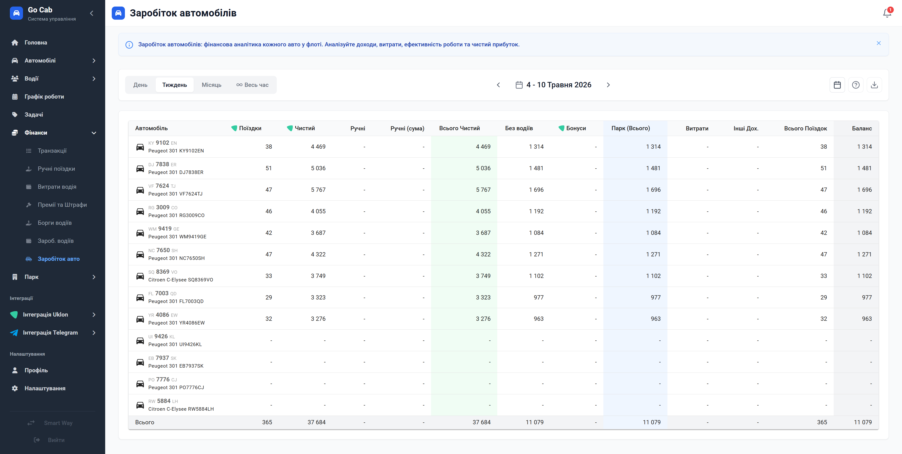

# Аналітика прибутковості авто: кожен актив під контролем

Дізнайтеся, який саме автомобіль у вашому парку приносить реальний прибуток, а який — потребує перегляду стратегії використання.

У бізнесі автопарку неможливо керувати тим, що не вимірюється. Модуль «Заробіток автомобілів» — це ваш інструмент для глибокого фінансового аналізу кожного транспортного засобу. Ми зібрали всі дані про доходи, витрати та ефективність в єдиний звіт, щоб ви могли приймати рішення на основі цифр, а не інтуїції. Баланс між пробігом, кількістю поїздок та чистим прибутком тепер перед вашими очима.

## Що ви отримуєте?

- **Об'єктивна оцінка активів:** Порівнюйте прибутковість різних моделей та років випуску — ви точно знатимете, чим ефективніше керувати.
- **Повна фінансова прозорість:** Доходи та витрати згруповані таким чином, щоб ви миттєво бачили "чисту" маржу з кожного авто.
- **Інструменти для масштабування:** Виявляйте найбільш рентабельні одиниці парку та інвестуйте у розвиток саме цих напрямків.
- **Швидкість звітування:** Експорт в Excel дозволяє інтегрувати дані в будь-які інші фінансові системи чи звіти для партнерів.
- **Динамічний аналіз:** Перемикайтеся між різними часовими періодами та сортуйте список за показниками, що є пріоритетними для вас сьогодні (пробіг, кількість поїздок чи загальний дохід).

## Ваші кроки до високої ефективності

1.  **Визначте період:** Оберіть часові рамки аналізу — від короткого звіту за тиждень до глобальної картини за квартал.
2.  **Сортуйте та фільтруйте:** Знайдіть лідерів за доходами або аутсайдерів за витратами за допомогою гнучких інструментів сортування.
3.  **Вивчайте деталі:** Клікніть на авто, щоб отримати повний зріз фінансової активності та зрозуміти природу прибутковості або збитковості.
4.  **Аналізуйте розрахунки:** Ви завжди можете перевірити логіку формування звіту, щоб бути впевненими у кожній цифрі.

## Функціональна довідка

### Деталі заробітку

Глибока деталізація фінансових показників авто: аналізуйте ефективність у розрізі поїздок, витрат та бонусів.

### Розуміння логіки

Повний доступ до методології розрахунків: ми підтримуємо прозорість, щоб ви могли точно розуміти структуру кожного звіту.
