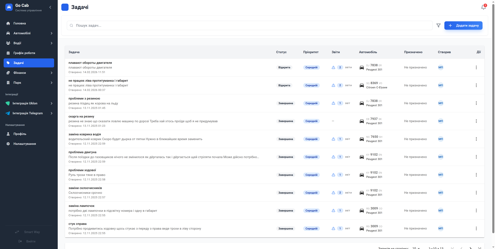

# Задачі

**Керуйте поточними справами вашого автопарку та відстежуйте їх статус у режимі реального часу.**

Ваш список задач: тут ви можете створювати нові задачі, призначати відповідальних, прив'язувати їх до автомобілів та відстежувати статус виконання. Це центральний хаб для контролю всіх операційних процесів, який допомагає нічого не забути та вчасно реагувати на потреби парку.

## Можливості для вашого бізнесу

- **Повний цикл управління задачами.** Легко створюйте нові доручення, редагуйте деталі або видаляйте неактуальні записи. Ви отримуєте повноцінний інструмент контролю у кілька кліків.
- **Інтелектуальна фільтрація.** Знаходьте потрібні завдання за будь-якими параметрами. Це дозволяє диспетчеру миттєво фокусуватися на найважливішому.
- **Розумний пошук у реальному часі.** Шукайте задачі за назвою або текстом. Система починає пошук одразу, як ви вводите символи, заощаджуючи ваш час.
- **Гнучка пагінація.** Налаштовуйте кількість відображуваних записів на сторінці для максимально зручного огляду.
- **Динамічний контроль статусів.** Змінюйте статус задачі відповідно до етапу виконання. Це дає прозору картину робочих процесів у парку.
- **Завершення задач із коментарями.** Фіксуйте результати виконання, додаючи важливі замітки. Це допомагає зберігати контекст та історію рішень.
- **Доступність з будь-якого пристрою.** Завдяки адаптивній верстці ви можете керувати задачами як з десктопа в офісі, так і з мобільного телефону.
- **Автоматичне збереження вашого фокуса.** Система синхронізує обрані фільтри з URL та локальним сховищем — ви завжди повертаєтесь до актуального списку.

## Форми та дії

### Форма завдання

Зручний інструмент для швидкого планування. Просто вкажіть назву та оберіть пріоритет — ви також можете одразу призначити відповідального виконавця та прив'язати задачу до конкретного автомобіля для кращого обліку.

### Деталі задачі

Повний огляд завдання в одному вікні. Переглядайте розширений опис, призначеного виконавця, встановлені терміни та всю історію коментарів, щоб завжди бути в курсі прогресу.

## Поради та сценарії використання

- **Контекстна робота:** Сторінка автоматично запам'ятовує ваші налаштування. Ви можете перемикатися між різними модулями системи, а повернувшись до задач, побачити саме той відфільтрований список, який вам потрібен.
- **Швидка реакція:** Використовуйте інтелектуальний пошук для миттєвої навігації по списку — система реагує на введення плавно, допомагаючи знайти критично важливу задачу за лічені секунди.
